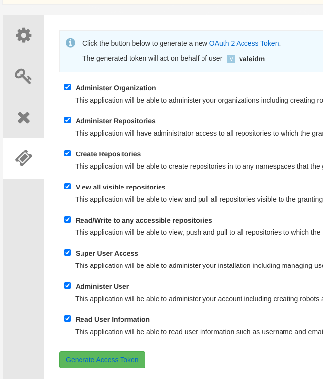

## Mass Quay Configurator (mqc) configures multiple Red Hat Quay instances in terms of:

- Organizations
  - Teams
  - Users
  - Robots
- Repositories
  - Users permissions
  - Robots permissions
  - Teams permissions
  - Notifications on failed mirror 
    - Only Post webhook supported
  - Mirror 
    - image tags
    - proxy
    - sync time
    - tls
    - credentials

Each organization's config is declared using a simple yaml files that can be safetly stored on git:

- All the login details for the quay endpoint and for the optional repository mirror are stored in a separate file, ready to be mounted as a Kubernetes secret. Is a best pratice to store the secret data in an external Vault service like HashiCorp Vault.

Each organizations yaml config can be easily replicated to another Quay instance.

## Table of contents

- [Features](#features)
- [Use cases](#cases)
- [Quay tenancy model](#quaymodel)
- [Organization yaml file](#orgquayfile)
- [Mass Quay Configurator deep dive](#deepdive)
- [Build](#build)
- [Getting a Quay super user oauth token](#quaytoken)
- [Usage](#usage)
- [Troubleshooting](#troubleshoot)
- [Podman](#podman)
- [Compatibility Matrix](#matrix)
- [License](#license)
- [Credits](#credits)


## Features

- Fully declarative Quay organization config
- Blazing fast Async engine (using the Tokio runtime)
  
  - [Async vs other concurrency models](https://rust-lang.github.io/async-book/01_getting_started/02_why_async.html)

- Global Api Rate limiter

  - Using [Governor](https://docs.rs/governor/latest/governor/) 
- Timeout setting
- Yaml files configurations checker
- Low memory and cpu usage
- Shell completion

  - Using [Clap complete](https://crates.io/crates/clap_complete)
- Mass creation and deletion of Quay organizations
- Replication of a Quay organization to others Quay endpoints

<div id='cases'/>

## Use cases
Typically, multiple Quay instances are utilized in different scenarios like:
- Business continuity
- Multi-cloud 
- Hybrid-cloud

Maintaining all those Quay configurations manually in terms of Quay organizations, repository configurations and RBAC checking is quite difficult and can lead to a lot of misconfiguration.

The Mass Quay Configurations tool uses the declarative way to solve the before mentioned problem.

All of Quay's configurations can be safely stored in a Git server (there is no sensitive information in the yaml configurations file). The Git server is the source of truth.

All Quay's endpoint tokens, and the (optional) repository mirror passwords, are stored in a separate file that can (must) be encrypted depending on the technology used by the company, for instances:

- If used on K8s/OpenShift:
  - Store the login file in an external vault server like [Hashicorp Vault](https://www.vaultproject.io/) and mount the secret in the Deployment (example coming soon)
- If used with [Ansible](https://www.ansible.com/) or with [Ansible Automation Platform 2](https://www.redhat.com/en/technologies/management/ansible):
  - Crypt the login file with ansible vault.

When used in K8s/OpenShift, Mass Quay configurator should be managed by a tool like [ArgoCD](#https://argo-cd.readthedocs.io/en/stable/) or [Red Hat Advanced Cluster Management (RHACM)](https://www.redhat.com/en/technologies/management/advanced-cluster-management) to boost the automation workflow.


<div id='quaymodel'/>

## Quay tenancy model

From the official [Red HAt Quay documentation](https://access.redhat.com/documentation/en-us/red_hat_quay/3.8/html/use_red_hat_quay/user-org-intro#tenancy-model), the tenancy model looks like this:


It is <b>highly recommended</b> to read the official documentantion to familiarize with the tenancy model!

<div id='orgquayfile'/>


## Organization yaml file

The organization yaml file respect the tenancy model. Please see the sample files under the 'doc/example-yaml-files' for different configurations.

The rule is simple: one file for each Quay organizations:

```
---
# Quay endpoint fqdn
quay_endpoint: "example-registry-quay-quay.apps.ocp.seeweb.local"

# Optional. Replicate this configuration to different Quay instances
replicate_to:
  - example-registry-quay-quay2.apps.ocphub.lab.seeweb

# Organization name
quay_organization: exampleorg6

# Organization email
quay_organization_email: ""

# List of repositories
repositories:
  - name: alpine # Repository name
    description: "mirror of **quay.io/libpod/alpine**, mirrored tags: latest, v1"
    mirror: true # true or false. If true the repository mirror will be enabled
    mirror_params: # Considered only if mirror: true
        src_registry: quay.io # The image registry to mirror
        src_image: libpod/alpine # The image to mirror
        src_image_tags: # Image tags list to mirror
          - "latest"
          - "v1"
        # Optional username for connecting to src_registry
        # The relative password is asked after executing "mqc login"
        # ext_registry_username:

        #Verify tls of src_registry
        ext_registry_verify_tls: true

        # Robot account associated to this repository
        robot_username: writer

        # Mirror sync interval in seconds
        sync_interval: 86400
        is_enabled: true # This optional parameter enable/disable the scheduled sync each sync_interval. The default value if it is omited is false
        
        #Optional proxy settings for connecting to src_registry
        
        #https_proxy:
        #http_proxy:
        #no_proxy:

        #Optional for notification in case on mirror failure
        #notification: 
        #  - event: repo_mirror_sync_failed #required
        #    method: webhook #only webhook supported
        #    config: # required
        #      url: https://simple-python-post-webserver-git-webserver.apps.ocphub.lab.seeweb #required for webhook
        #    title: "my title" # optional
           
    #Optional robot and user permissions
    permissions:
        robots:
            - name: reader
              role: read
            - name: writer
              role: write
        users:
            - name: valeidm
              role: admin
        teams:
            - name: maintainers
              role: admin
  
  - name: demorepo
    description: "example of repository with mirror feature disabled"
    mirror: false

  - name: nested/demorepo
    mirror: false
    permissions:
        robots:
            - name: writer
              role: write
        users:
            - name: valeidm
              role: admin

# Organization's Robots
robots:
  - name: reader
    desc: "Reader Robot, generated by Mass Quay Configurator"
  - name: writer
    desc: "Writer Robot, generated by Mass Quay Configurator"

# Organization's Teams
teams:
  - name: maintainers
    description: ""
    members:
      users:
        - valeidm
      robots:
        - writer
    role: member
```

Create one file for each organizations and put it under a directory. 

The default directory is '<b>yaml-files</b>'. There is the '--dir' flag for using the directory of your choice.

The directory 'docs/example-yaml-files' contains some samples you can start with.


<div id='deepdive'/>

## Mass Quay Configurator deep dive 

Mass Quay Configurator uses Rust's async concurrency thanks to the Tokio runtime.
All the configured Quay organizations, are mass-created using this schema:

- Create all organizations 
- Create all organizations robots (if any)
- Create all organizations teams (if any)
  - add all teams member for all organizations (if any)
  - add all robots for all organizations (if any)
- Create all repositories for all organizations (if any)
  - add user permissions to all repositories for all organizations (if any)
  - add robots permissions to all repositories for all organizations (if any)
  - add mirror configurations to all repositories for all organizations (if any)
  - add mirror failure notification to all repositories for all organizations (if any)

If a configuration drift is detected, it is fixed using the organization's yaml files as a unique source of truth.


Thanks to async concurrency, the creation process lasts circa 15 seconds, whereas it could last up to 8 minutes if serial processing (like an Ansible playbook) is used.

Also, memory usage is as low as possible because concurrency is not obtained by spanning threads.


## Build

Mass Quay Configurator is written in Rust. In order to install the Rust compiler and Cargo please follow [these simple instructions](https://doc.rust-lang.org/cargo/getting-started/installation.html).

When the Cargo installation is completed, build the mqc release:

- ```cargo build --release```

The binay file full path will be:

- ```./target/release/mqc```

Feel free to copy the mqc binary in one of your $PATH directory.

<div id='quaytoken'/>

## Getting a Quay super user oauth token

Mass Quay Configurators needs a super user oauth token for each <b>Quay endpoints</b>

Follow these instruction to obtain a supuer user oauth token. Repeat this procedure for each Quay endpoints:

- Create a dummy organization (for example 'management') (A Quay super user is required)


- Click organization's 'Applications'


- Click 'Create New Application' and insert an application name (for example 'mqc')


- Click the 'mqc' Application


- Click 'Generate Token'


- Select all permissions



- Click 'Generate Access Token' and save the generated token.


<div id='usage'/>

## Usage

### Creating the login config files


- ```mqc login``` 

add the '--dir' flag if the organizations files are in a different directory than 'yaml-files'

This command detects all the required Quay endpoint tokens and all the repositories mirror required passwords:


This example uses five different organizations:

- basic-example-mirror
- basic-example-replicate-to
- basic-example-with-team-sync
- empty-repositories
- mirror-with-notification


All those organizations use the same Quay endpoint 'example-registry-quay-<b>quay1</b>.apps.ocphub.lab.seeweb' except for the basic-example-replicate-to organization that show how to replicate the org to different Quay instances.

Please see all the examples in the 'example-yaml-files' directory


The 'login' subcommand detects and asks the user to insert all the required Quay endpoints token and repositories mirror password.

All the input token and passwords are hidden from stdout.

Once the user has inserted the required information, the '.mqc/login.yaml' is created.

If the '.mqc/login.yaml' is already present, the 'login' sub-command asks the user if he wants to recreate it.

Here the 'login' sub-command in action:


The login.yaml file in the .mqc is just an example.

### Creating the Quay organizations

To create all the organizations, use the 'create' sub-command:


### Deleting the Quay organizations

To create all the organizations, use the 'delete' sub-command:


<div id='troubleshoot'/>

## Troubleshooting

### Global requests rate limiter

Mass Quay Configuration has a global requests rate limiter to avoid DDoS.
All the async requests are regulated by [governor](https://docs.rs/governor/latest/governor/), a production ready rust rate limiting crate.

Use the '<b>--max-requests-per-second</b>' option to set the max request per seconds.

The default vaulue is 50 requests per second.

### Request timeout

If a 'timeout' error is received, try to increase the timeout using the '<b>--timeout</b>' option.

The default vaulue is 5 seconds.

### Log level

Mass Quay Configurator supports two log levels using the '<b>log-level</b>' option:

- info 
- debug

The default value is 'info'

### Log verbosity

In the current version, Mass Quay Configurator increases log verbosity if the value passed to the '<b>--verbosity</b>' option is >=5.

The default value is 0.

All the logs are redirected to stdout.

### Skip TLS verification

Is it possible to skip TLS verification using the '<b>--tls-verify</b>' option. Possibile values are:

- true
- false 

The default value is set to 'false'.

<b>Skipping the TLS verification is not recommended in production.</b>


### Check the organizations yaml

The organizations yaml can be checked in terms of:

- Yaml Syntax
- Quay's endpoint tokex existence
- Quay's repository mirror password existence (if any)

Use the '<b>check</b>' sub-command to do all the checks.


In case of a missing field in an organizations yaml:


In case of a missing Quay endpoint token:


## Podman 

### Build

podman build -t mqc:v0.0.14 .

### Run

podman run -v ./yaml-files-test:/yaml-files:Z -v .mqc:/.mqc:Z mqc:v0.0.14 create

Mqc images: quay.io/valeube/mqc


<div id='matrix'/>

## Compatibility Matrix

| MQC   | Quay   | Result             |
|-------|--------|--------------------|
| 0.0.14| 3.10.4 | :heavy_check_mark: |
| 0.0.13| 3.8.7  | :heavy_check_mark: |
| 0.0.13| 3.8.6  | :heavy_check_mark: |
| 0.0.13| 3.8.5  | :heavy_check_mark: |
| 0.0.12| 3.8.4  | :heavy_check_mark: |
| 0.0.12| 3.8.3  | :heavy_check_mark: |
| 0.0.12| 3.8.2  | :heavy_check_mark: |
| 0.0.12| 3.8.1  | :heavy_check_mark: |
| 0.0.12| 3.8.0  | :heavy_check_mark: |
| 0.0.12| 3.7.10 | :heavy_check_mark: |
| 0.0.12| 3.7.9  | :heavy_check_mark: |
| 0.0.12| 3.7.8  | :heavy_check_mark: |
| 0.0.12| 3.7.7  | :heavy_check_mark: |
| 0.0.12| 3.7.6  | :heavy_check_mark: |
| 0.0.12| 3.7.5  | :heavy_check_mark: |
| 0.0.12| 3.7.4  | :heavy_check_mark: |
| 0.0.12| 3.7.2  | :heavy_check_mark: |
| 0.0.12| 3.6.x  | :x:                |


## License

Please see the [LICENSE](LICENSE) file.

## Credits

Mqc is based on an idea of a colleague of mine, [Andrea Miglietta](https://github.com/amigliet/), who has created the concept of the organization data structure and has implemented all the automations in Ansible. 


